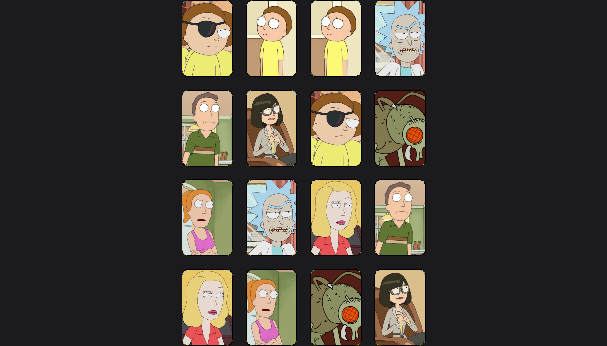

# Memory-Card-Game

> The memory game is a classic game made up of pieces that have a figure on one side. Each figure is repeated in two different pieces. To start the game, the pieces are placed face down so that they cannot be seen.

## Table of contents

- [Overview](#overview)
  - [The challenge](#the-challenge)
  - [Links](#links)
  - [Screenshot](#screenshot)
- [My process](#my-process)
  - [Built with](#built-with)

## Overview

### The challenge

Users should be able to:

- Be able to play the game and complete it
- Find two pairs of each character
- View on different screens
- Start the game from the home screen

### Links

- Live Site URL: https://memory-card-game-rafael.netlify.app

### Screenshot

  - Desktop
  
    
    
  - Mobile
    
    

## My process

### Built with

- HTML
- CSS
- JAVASCRIPT

[⬆ Back to the top](#memory-card-game) 
